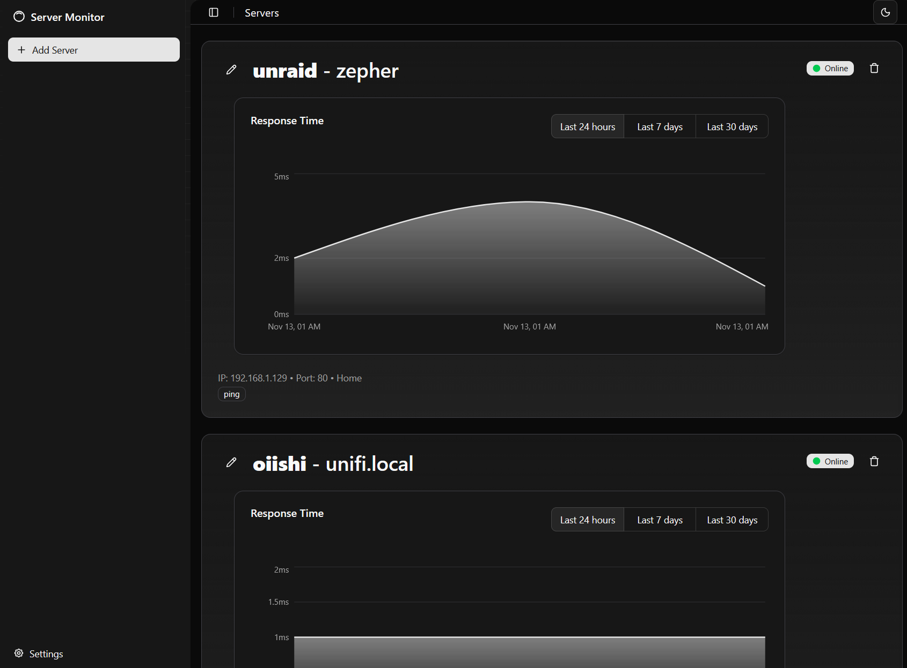
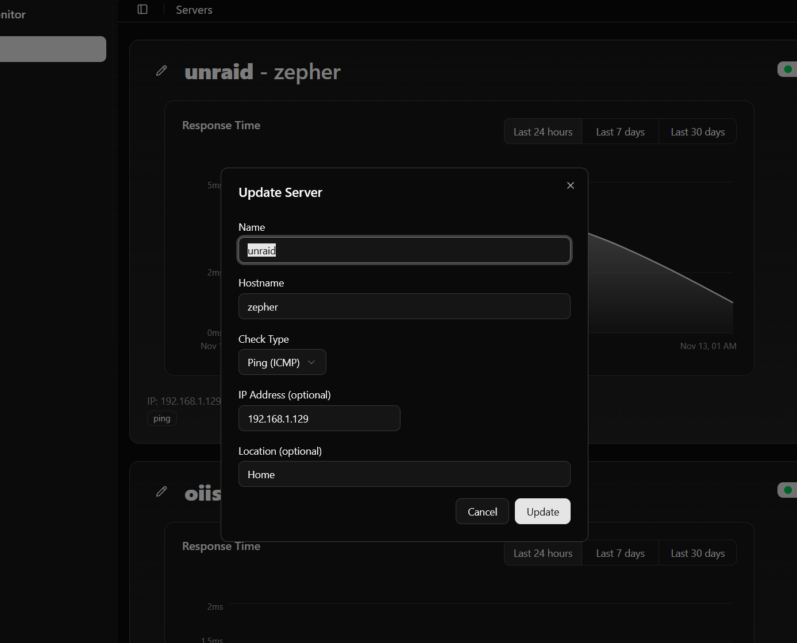

# Server Health Monitor

A full-stack server monitoring application that tracks infrastructure health and uptime through automated port checks and ICMP ping monitoring. Built with Spring Boot (Kotlin) backend and React TypeScript frontend.


## Features

- **Real-Time Dashboard**: Live status updates with auto-refreshing badges and metrics
- **Historical Metrics**: Track server uptime and response times over configurable time periods
- **Multiple Check Types**:
    - Port
    - ICMP
- **Response Time Tracking**: Monitor and visualize server response times with interactive charts
- **Uptime Calculations**: Automatic uptime percentage calculations for SLA tracking
- **Containerized Deployment**: Docker Compose for one-command setup
- **Type-Safe Frontend**: Full TypeScript implementation with Zod validation

### Dashboard



---



##  Tech Stack

### Backend
- **Kotlin** - Primary language
- **Spring Boot** - Application framework
- **PostgreSQL** - Primary database

### Frontend
- **React** - UI library
- **TanStack Query** - Data fetching and caching
- **Zod** - Schema validation
- **Recharts** - Data visualization
- **shadcn/ui** - UI components
- **Vite** - Build tool

##  Prerequisites

- **Docker Desktop** (or Docker Engine + Docker Compose)
- **JDK 17+** (for local development)
- **Node.js 18+** (for local frontend development)

##  Quick Start

### Option 1: Docker Compose (Recommended)

```bash
# Clone the repository
git clone https://github.com/spector700/server-health.git
cd server-health

# Start all services
docker-compose up --build

# Access the application
# Frontend: http://localhost:3000
# Backend API: http://localhost:8080/api
# Database: localhost:5432
```

### Option 2: Local Development

#### Backend
```bash
# Navigate to backend directory
cd backend

# Start PostgreSQL with Docker
docker-compose up -d postgres

# Run the application
./gradlew bootRun

# API will be available at http://localhost:8080
```

#### Frontend
```bash
# Navigate to frontend directory
cd frontend

# Install dependencies
npm install

# Start development server
npm run dev

# Frontend will be available at http://localhost:5173
```
##  Monitoring Features

### Check Types

1. **Port Check**
    - Tests if a specific TCP port is open
    - Useful for web servers, APIs, databases

2. **Ping Check (ICMP)**
    - Tests basic network reachability
    - Works for any networked device

## Deployment

### Docker Compose Deployment

```bash
# Build and start in detached mode
docker-compose up -d --build

# View logs
docker-compose logs -f

# Stop services
docker-compose down

# Stop and remove volumes (WARNING: deletes data)
docker-compose down -v
```